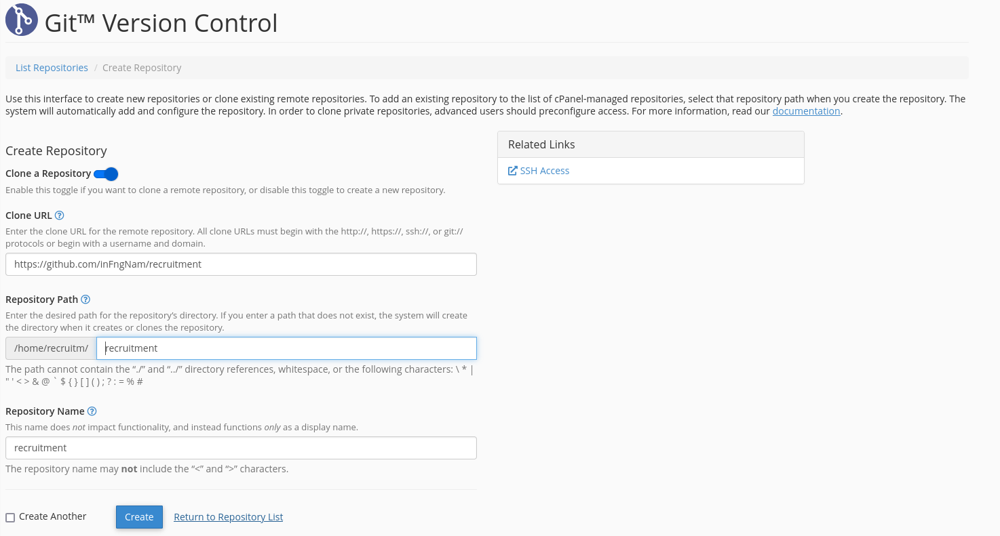
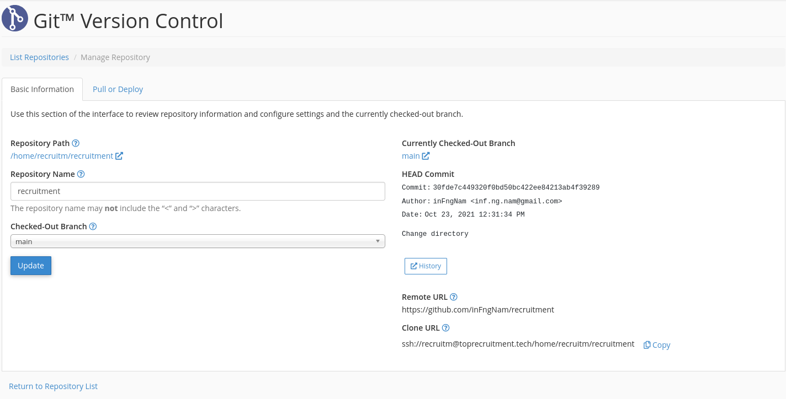
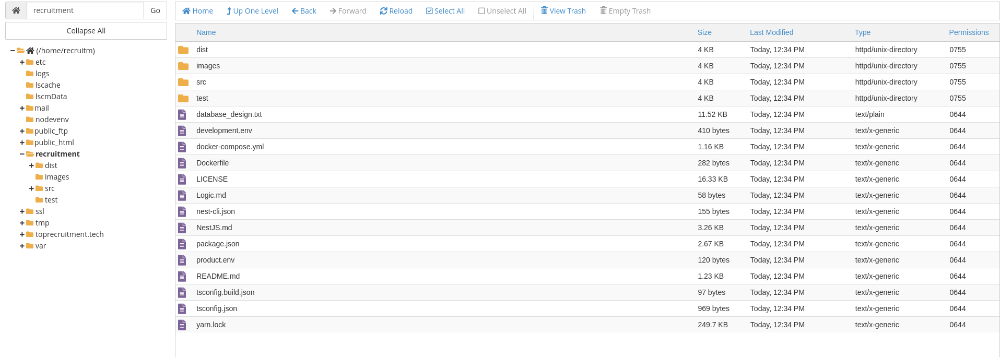
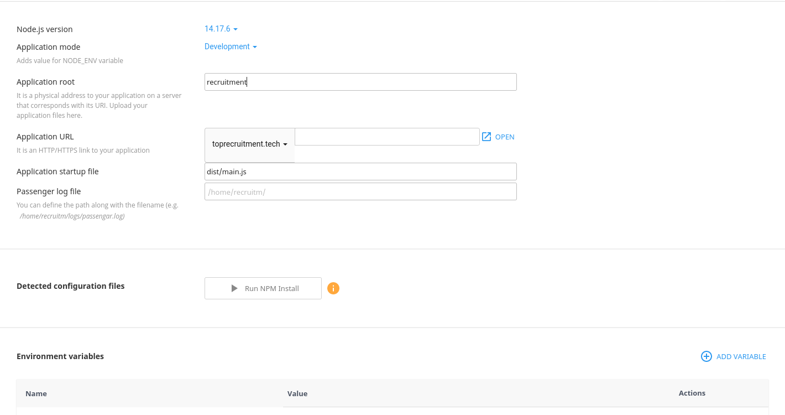
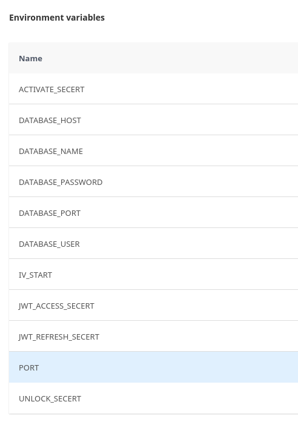
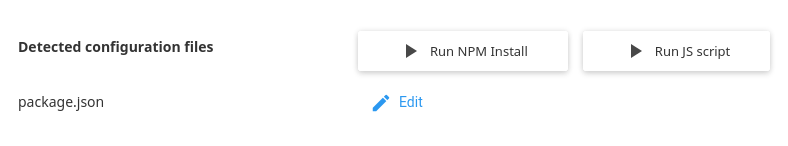

<!-- # Hướng dẫn sử dụng đơn giản trên Shared Hosting (cPanel)

---

Sau khi truy cập và đăng nhập vào cPanel để cấu hình, cài đặt các ứng dụng cho hosting thì có thể làm theo các bước sau

### B1: Lấy code của dự án về

Nhập thông tin của quản lý các phiên bản của dự án

Sau khi tạo xong thì sẽ có phần update(hay pull) các commit cập nhật mới dự án

Có thể thấy trong thư mục trong File

### B2: Cài môi trường chạy NodeJS cho ứng dụng

Nhập đủ các biến môi trường yêu cầu cho ứng dụng

Lưu cài đặt lại, sau khi lưu cài đặt hệ thống sẽ bắt file **package.json**, sử dụng **Run NPM install** để cài đặt các gói, thư viện sử dụng.

Sau đó ứng dụng có thể chạy được bình thường

. -->
